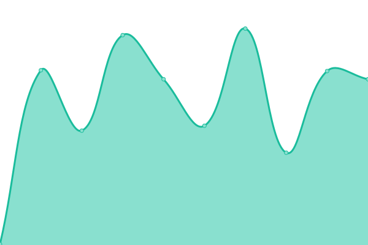

# [📈 Live Status](https://status.lexian.dev): <!--live status--> **🟧 Partial outage**

This repository contains the open-source uptime monitor and status page for [Upptime](https://upptime.js.org), powered by [Upptime](https://github.com/upptime/upptime).

With [Upptime](https://upptime.js.org), you can get your own unlimited and free uptime monitor and status page, powered entirely by a GitHub repository. We use [Issues](https://github.com/upptime/upptime/issues) as incident reports, [Actions](https://github.com/lexiandev/status.lexian.dev/actions) as uptime monitors, and [Pages](https://status.lexian.dev) for the status page.

<!--start: status pages-->
<!-- This summary is generated by Upptime (https://github.com/upptime/upptime) -->
<!-- Do not edit this manually, your changes will be overwritten -->
<!-- prettier-ignore -->
| URL | Status | History | Response Time | Uptime |
| --- | ------ | ------- | ------------- | ------ |
|  [LexianDEV](https://www.lexian.dev) | 🟥 Down | [lexian-dev.yml](https://github.com/LexianDEV/status.lexian.dev/commits/HEAD/history/lexian-dev.yml) | 

 1898ms
     
 | 

<a href="https://status.lexian.dev/history/lexian-dev">96.91%</a>
    

|  [LexianAPP](https://app.lexian.dev) | 🟩 Up | [lexian-app.yml](https://github.com/LexianDEV/status.lexian.dev/commits/HEAD/history/lexian-app.yml) | 

 5750ms
     
 | 

<a href="https://status.lexian.dev/history/lexian-app">97.39%</a>
    

|  [GoExport](https://goexport.lexian.dev) | 🟩 Up | [go-export.yml](https://github.com/LexianDEV/status.lexian.dev/commits/HEAD/history/go-export.yml) | 

 163ms
     
 | 

<a href="https://status.lexian.dev/history/go-export">100.00%</a>
    

|  [FlowKit](https://flowkit.lexian.dev) | 🟩 Up | [flow-kit.yml](https://github.com/LexianDEV/status.lexian.dev/commits/HEAD/history/flow-kit.yml) | 

 212ms
     
 | 

<a href="https://status.lexian.dev/history/flow-kit">100.00%</a>
    

<!--end: status pages-->

[**Visit our status website →**](https://status.lexian.dev)

## 📄 License

- Powered by: [Upptime](https://github.com/upptime/upptime)
- Code: [MIT](./LICENSE) © [Anand Chowdhary](https://anandchowdhary.com), supported by [Pabio](https://pabio.com)
- Data in the `./history` directory: [Open Database License](https://opendatacommons.org/licenses/odbl/1-0/)
